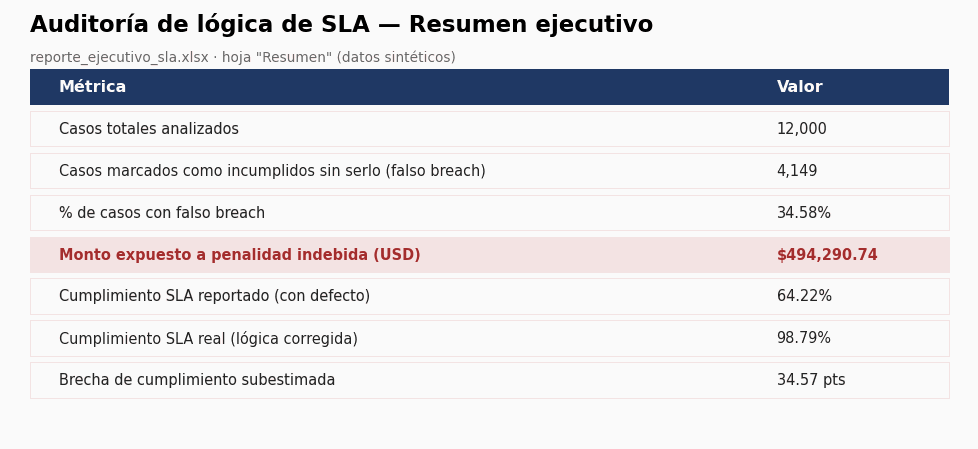

[](https://github.com/clr-techlead/telecom-sla-billing-audit/actions/workflows/python-tests.yml)


🌐 English | [Español](README.es.md)

# SLA logic audit and billing exposure in telecommunications

Python pipeline that detects and quantifies a business-logic defect in SLA compliance calculation, and automates the executive report of the finding.

> **Note on the data:** this repository uses 100% synthetic data generated with a fixed seed, with no relation to any real client, employer, or information. The goal is to show the data-audit methodology applied to a real telecom industry problem (billing tied to SLA compliance), not to expose any third party's confidential information.

## The business problem

In telecommunications operations, SLA compliance is often directly tied to billing: a case that breaches its SLA can trigger a contractual penalty or a service credit to the client.

A common failure pattern: the calculation logic measures resolution time in **calendar hours (24/7)** instead of **business hours (Monday to Friday, working hours)**. Since the calendar clock never stops, a case opened on a Friday afternoon accumulates hours quickly over the weekend and shows up as "breached" — even though the team resolved it within the real working-hours window.

The result: cases flagged as breaches that were not real breaches, with two consequences:

1. **Economic** — exposure to penalties or service credits that did not actually apply.
2. **Reputational** — a worse-than-real performance picture in front of the client.

## What this project does

| Script | Function |
|---|---|
| `src/generate_synthetic_data.py` | Generates 12,000 synthetic support/billing cases with open date, close date, case type, and target SLA. |
| `src/sla_audit.py` | Calculates compliance under the defective logic (calendar hours) and the correct logic (business hours), and quantifies the difference. |
| `src/report_generator.py` | Automates the generation of an executive Excel report from the audit — replaces manually building tables case by case. |

## Audit result (on synthetic data)

```
Total cases analyzed:                12,000
Cases wrongly flagged as breached
  (false breach):                    4,149  (34.58%)
Amount exposed to undue penalty:     USD 494,290.74
Reported compliance (with defect):   64.22%
Real compliance (corrected):         98.79%
Underestimated compliance gap:       34.57 points
```



In other words: under the correct logic, this synthetic operation's real compliance is 98.79%, not 64.22% as the defective calculation reported — a gap of more than 34 percentage points, with almost half a million dollars in billing potentially affected by a penalty that should never have applied.

## How to run it

```bash
pip install -r requirements.txt
python src/generate_synthetic_data.py   # generates data/synthetic_cases.csv
python src/sla_audit.py                  # runs the audit, prints a summary
python src/report_generator.py           # generates outputs/sla_executive_report.xlsx
```

## Tech stack

- **Python** — pandas, numpy for the data pipeline
- **openpyxl** — automated Excel report generation
- Business logic is modularized: data generation, the audit engine, and the reporting layer are kept separate, mirroring how a real production pipeline is structured

## Context

This project is inspired by the kind of work I do as a data analyst in telecommunications: managing SLA and billing reporting for multi-country operations, and detecting inconsistencies in calculation logic with direct economic impact. The data and figures in this repository are illustrative; they do not correspond to any real employer or client.

---

**Camilo Andrés León Rubriche** — Data & BI Analyst
[LinkedIn](https://www.linkedin.com/in/caleru) · [email](mailto:camiloleonrubriche@outlook.com)


## Tests

Run the unit tests locally with:

```bash
python -m unittest discover tests -v
```
